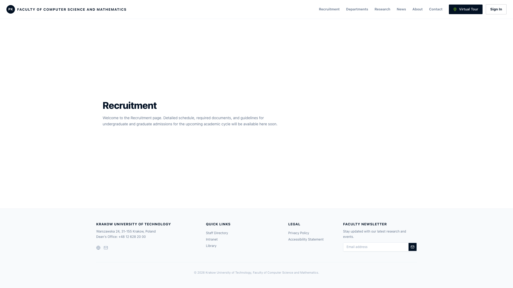
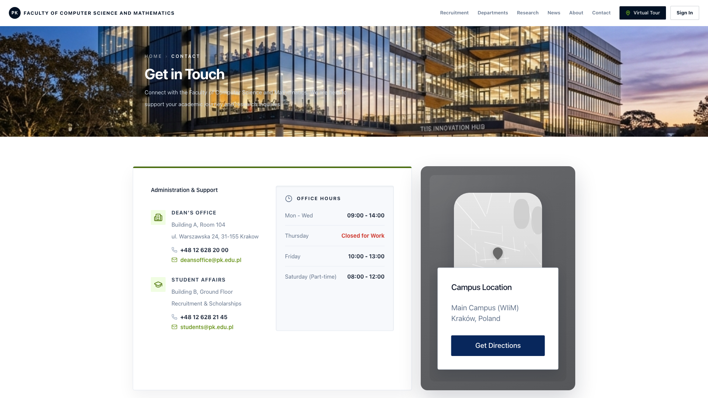
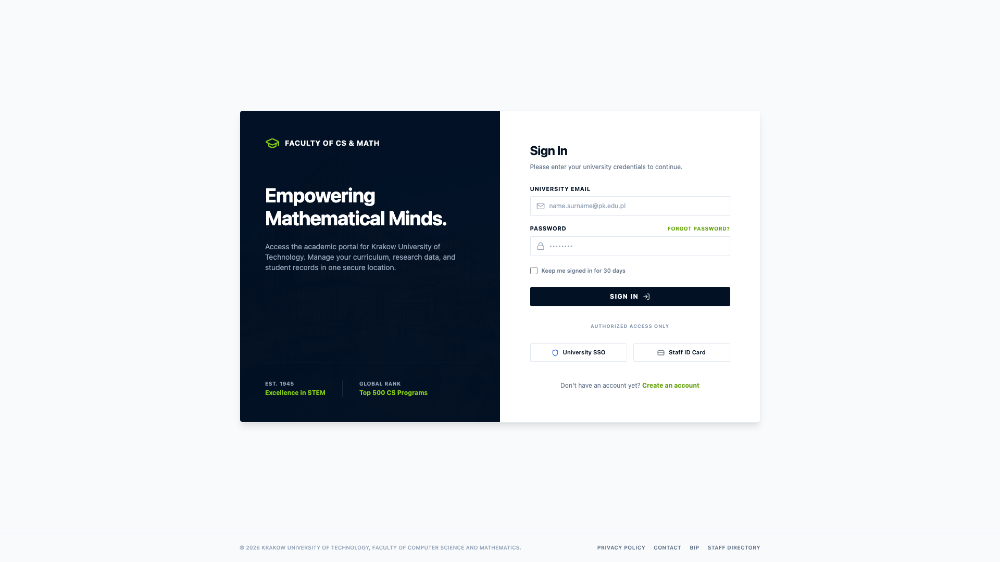
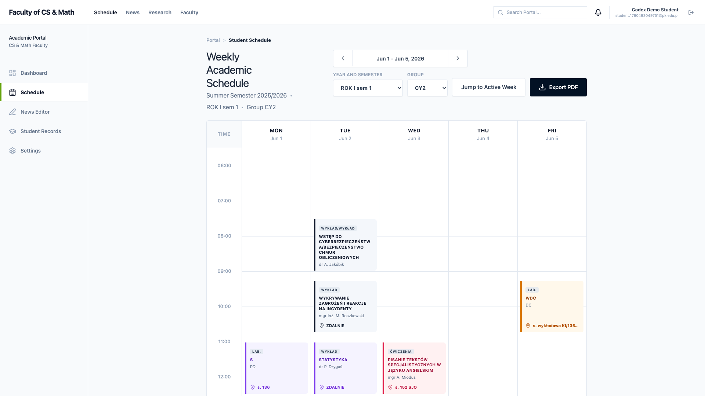
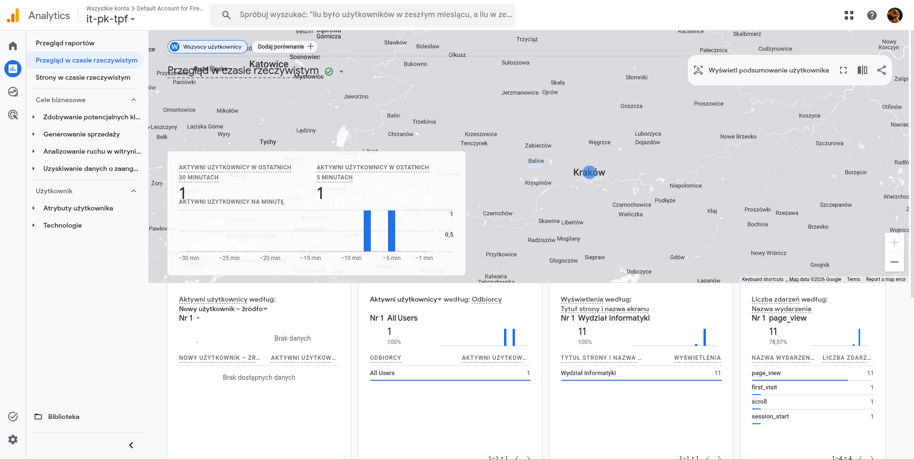
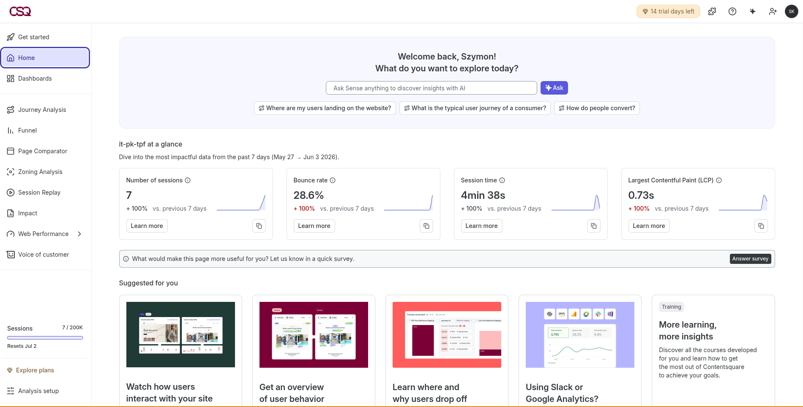

# IT PK

Alternatywny portal wydziałowy zbudowany w `React + Vite + TypeScript + Tailwind CSS`, łączący publiczną stronę informacyjną z obszarem aplikacyjnym opartym o Firebase.

## Demo

Produkcja: [https://it-pk-five.vercel.app](https://it-pk-five.vercel.app)

## Zakres projektu

- publiczne widoki wydziału: strona główna, rekrutacja, jednostki, badania, aktualności, kontakt
- logowanie i rejestracja użytkowników
- panel aplikacyjny po zalogowaniu
- integracja z Firebase Authentication i Firestore
- integracja analityczna z Google Analytics 4 i Hotjar

## Stos technologiczny

- `React 19`
- `TypeScript`
- `Vite`
- `React Router`
- `Tailwind CSS`
- `Firebase`
- `react-ga4`
- `@hotjar/browser`

## Uruchomienie lokalne

```bash
npm install
npm run dev
```

Build produkcyjny:

```bash
npm run build
```

## Zmienne środowiskowe

Do konfiguracji należy wykorzystać lokalny plik `.env`, oparty o zawarty w repozytorium `.env.example`.

Aktualnie używane klucze:

- `VITE_FIREBASE_API_KEY`
- `VITE_FIREBASE_AUTH_DOMAIN`
- `VITE_FIREBASE_PROJECT_ID`
- `VITE_FIREBASE_STORAGE_BUCKET`
- `VITE_FIREBASE_MESSAGING_SENDER_ID`
- `VITE_FIREBASE_APP_ID`
- `VITE_GA_MEASUREMENT_ID`
- `VITE_HOTJAR_VERSION`
- `VITE_HOTJAR_SITE_ID`

## Screeny aplikacji

### Strona główna


### Rekrutacja



### Kontakt



### Logowanie



### Plan zajęć po zalogowaniu



## Google Analytics

Integracja GA4 jest aktywowana przez `VITE_GA_MEASUREMENT_ID` i wysyła podstawowe zdarzenia page view.




## Hotjar

Integracja Hotjar jest aktywowana przez zmienne środowiskowe `VITE_HOTJAR_VERSION` i `VITE_HOTJAR_SITE_ID`.


